Tweetbot - Multithreaded Tweet Catcher
===========================================

This is Tweetbot, a multithreaded Twitter Informational Retrival System. The Crawler has been designed and tested on Mac OS X, but it should work on Linux or other Unix based Systems.

We have included a [tutorial](#tutorial) with pictures at the end.

Overview of system
------------------
1.	We crawl tweets based on their geolocation
a.	We only crawled tweets whose geolocation was in the USA
2. The System is Multithreaded, and by default has one crawler thread, one parser thread, and a saver thread.
3. Working:-
	-	Streamer thread catches the tweet and gives it to the parser thread.
	-	The parser then parses the tweet, and stores the title, if the tweet includes a url. It then gives the tweet to the saver thread.
	-	Saver thread saves the tweet to the file. If the file size is too big, it creates a new file
4.	We used multiple threads to parse the tweets
a.	While one tweet is being parsed, the crawler fetches another tweet, and another thread starts parsing that tweet, and so on.

Installation
------------

###Clone the repository
```bash
git clone https://github.com/tweetbot/tweetbot.git
```

###Install pip and

```bash
#On mac, to install pip, run
sudo easy_install pip
#update
sudo pip install --upgrade pip

#On Linux, run
sudo apt-get install python-pip
sudo apt-get install libxml2-dev libxslt1-dev python-dev
#Then update pip using
sudo pip install --upgrade pip
```
###Install virtualenv and other dependencies

```bash
#install virtual env
sudo pip install virtualenv

#Create a new virtual environment in the current folder.
#This will make sure that the dependencies for tweetbot 
#do not cause a conflict with the dependencies for your
#own projects. 
virtualenv tweetbot_env

#To use the virtual environment, first we need to #activate it
source tweetbot_env/bin/activate

#install dependencies
pip install -r requirements.txt

#run tweetbot with help flag to learn more
python tweetbot.py -h

#to deactivate the virtualenv
deactivate
```

Collaboration
-------------

**Bold** = potential extra credit.

####[Anmol Singh Hundal](hundal.me)
1.	**Multithreading when parsing the .txt files including the crawled tweets. Could have also multithreaded when crawling, but twitter doesn’t allow that.**
2.	**Checked robots.txt before crawling the link(s) in the tweets.**
3.	Fetched and parsed webpages, then extracted the title of the page, and stored that title as an extra attribute along the tweet.
4.	**Allows user input to customize the size of each file, and the total number of files stored.**
5.	**Allows user to determine the number of parser threads through command line flags.**
6.	User input to determine the output path.
7. **Added support for POSIX path expansion. For e.g. "~" expands to the $HOME variable.**

####[Amr Elsisy](https://github.com/amrelsisy)
1.	Crawled tweets based on their location.
2.	Output tweets to .txt files, by default each file is 10 MB, or any other size the user specifies. When the file has 10 MB worth of data, it’s closed and a new one is created, where we can continue outputting tweets to. 
3.	Determined the total size of data stored, 5GB by default, unless the user specifies otherwise. The twitter streamer is closed after we have collected the amount of data desired. 

System limitations:
------------------
-	Our system doesn’t detect if two tweets contain the same contents.
-	Our system doesn’t parse images, it only parses text files.

Tutorial<a name="tutorial"></a>
--------
-	First clone the repository.
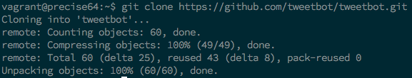

-	Change into the repository and install pip
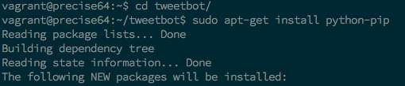

-	Upgrade Pip
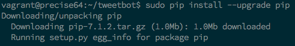

-	Install Virtualenv
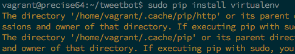

-	Create a new virtual environment.
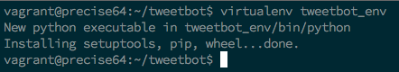

-	Source the virtual environment.
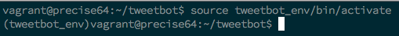

-	Install other dependencies if you are on linux.
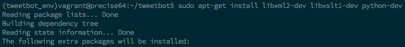

-	Install tweetbot requirements.
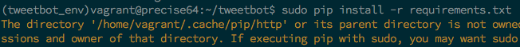

-	Run tweetbot with the help command to see the list of flags that can be passed.
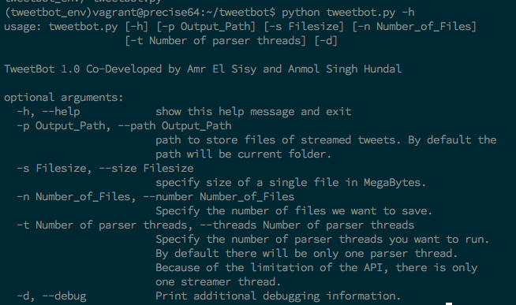

-	Tweetbot in action with command line flags.
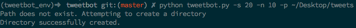

-	After you are done, deactivate the virtual environment.
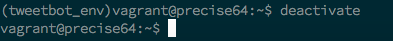


##The MIT License

Permission is hereby granted, free of charge, to any person obtaining a copy
of this software and associated documentation files (the "Software"), to deal
in the Software without restriction, including without limitation the rights
to use, copy, modify, merge, publish, distribute, sublicense, and/or sell
copies of the Software, and to permit persons to whom the Software is
furnished to do so, subject to the following conditions:

The above copyright notice and this permission notice shall be included in
all copies or substantial portions of the Software.

THE SOFTWARE IS PROVIDED "AS IS", WITHOUT WARRANTY OF ANY KIND, EXPRESS OR
IMPLIED, INCLUDING BUT NOT LIMITED TO THE WARRANTIES OF MERCHANTABILITY,
FITNESS FOR A PARTICULAR PURPOSE AND NONINFRINGEMENT. IN NO EVENT SHALL THE
AUTHORS OR COPYRIGHT HOLDERS BE LIABLE FOR ANY CLAIM, DAMAGES OR OTHER
LIABILITY, WHETHER IN AN ACTION OF CONTRACT, TORT OR OTHERWISE, ARISING FROM,
OUT OF OR IN CONNECTION WITH THE SOFTWARE OR THE USE OR OTHER DEALINGS IN
THE SOFTWARE.